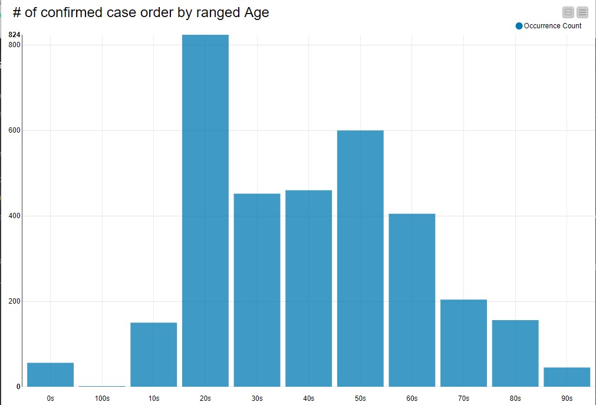
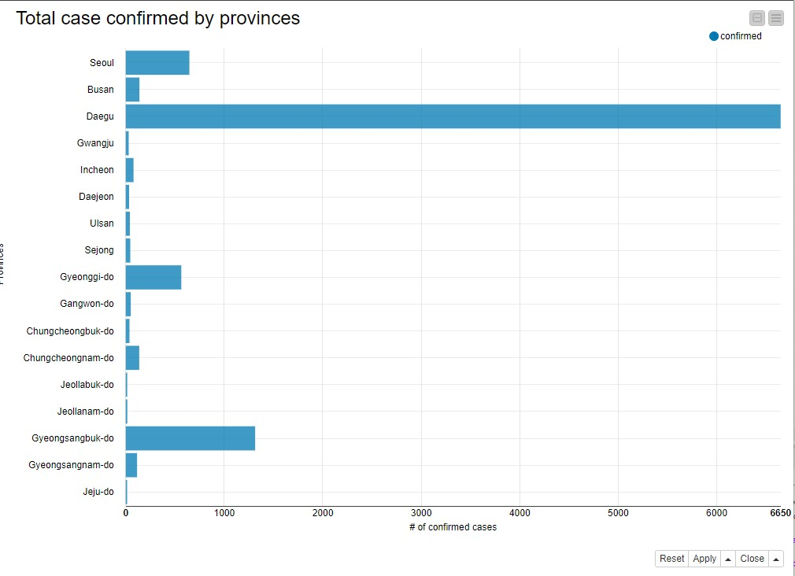
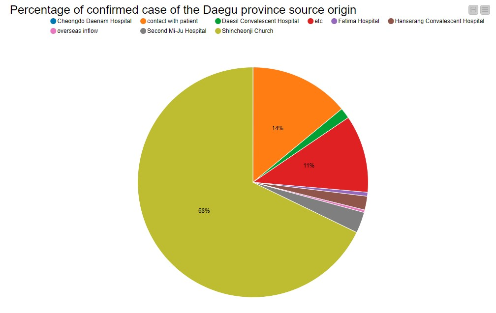
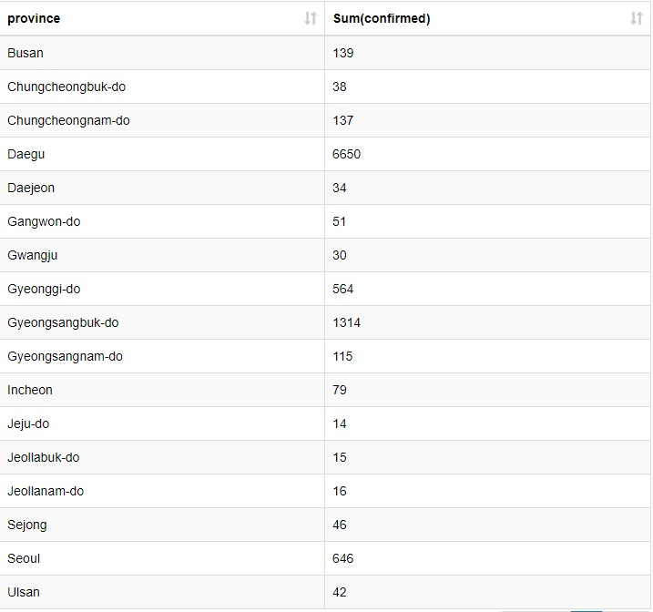
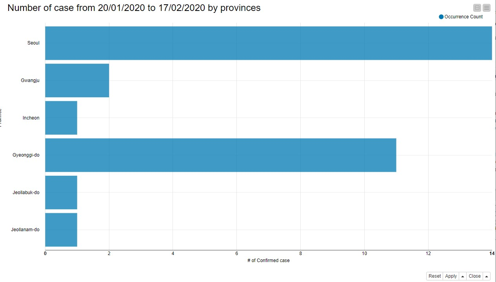
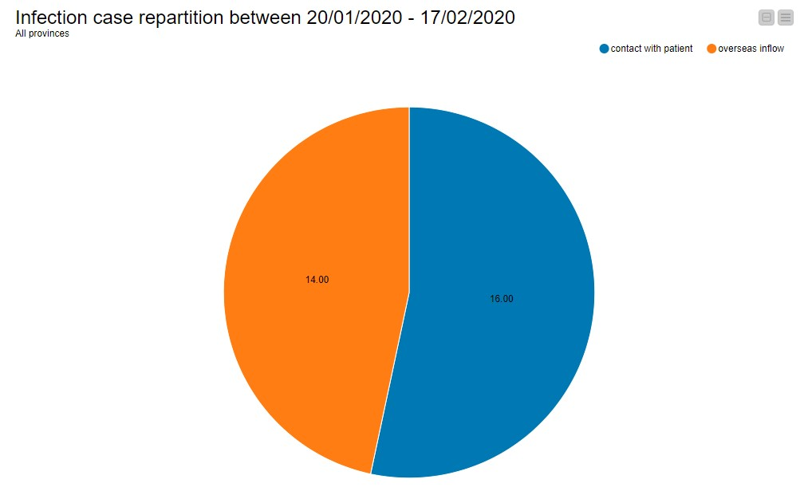
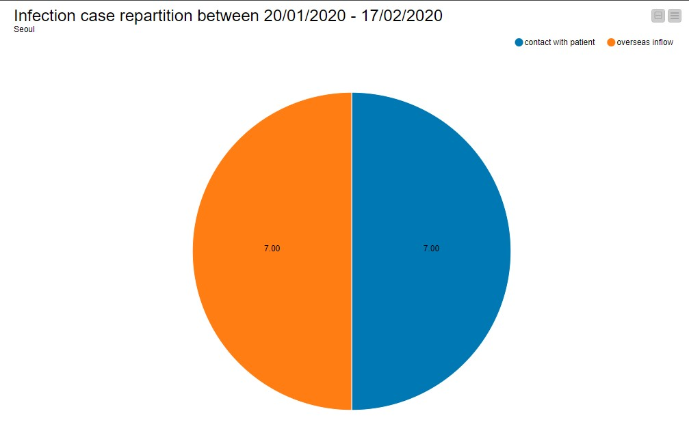
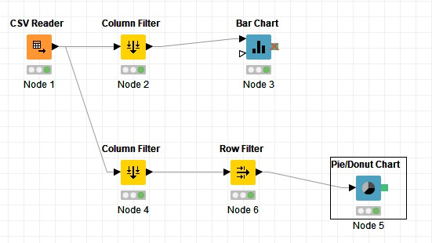
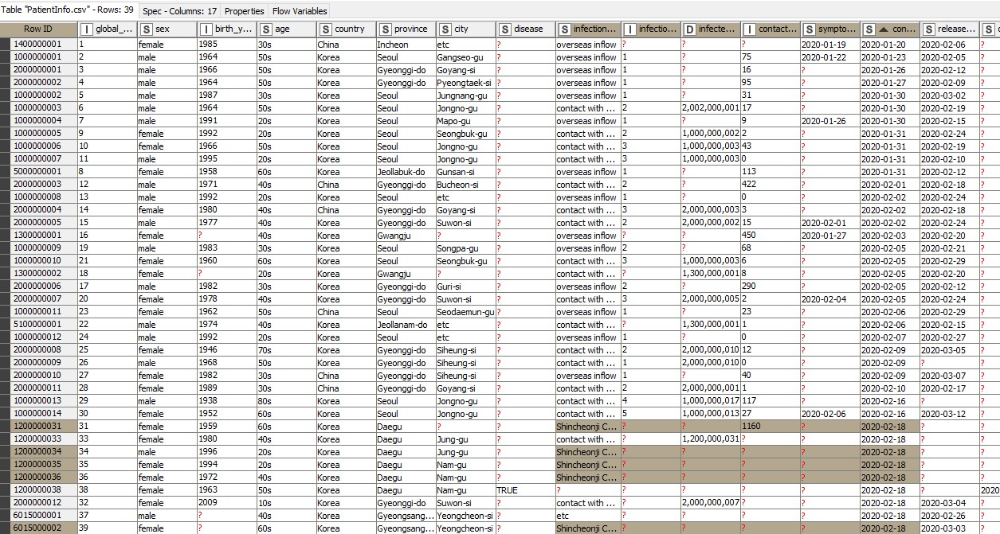
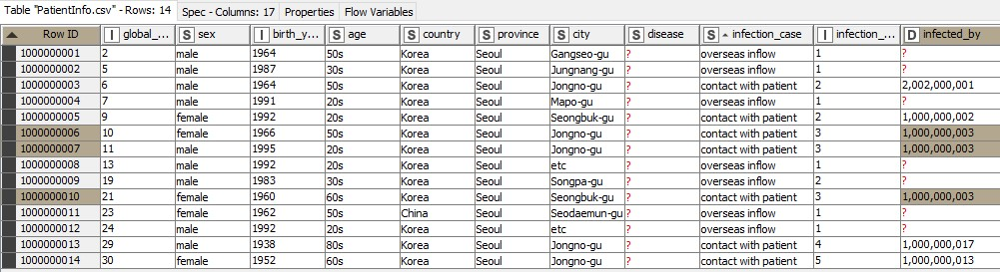

# Exploration des données du COVID-19 (SarS-CoV-2) #

| Nom / Prenom   | Numéro Etudiant |
| -------------- | --------------- |
| Sheikh Rakib   | 11502605        |
| Daudin Louise  | 11606555       |

## Remercients ##

>  Nous tenons principalement à remercier le gouvernement sud-coréen pour la mise à dispositions des données de leur patients en open data qui est disponible (à cette adresse) [à cette addresse](https://github.com/jihoo-kim/Data-Science-for-COVID-19) et [à cette adresse officiel](http://www.cdc.go.kr/)


## Introduction ##

>Ceci est un rapport dans un contexte du devoir universitaire pour l'Institut Galilée pour le module nommé Visualisation de données supervisé par Monsieur GROZAVU Nistor, enseignant rattaché au laboratoire LIPN.
>
>Les données utilisées proviennent de la mise à disposition en open data des données détaillées et anonymisés de la pandémie actuelle nommée Covid-19 (Virus SarS-Cov-2) plus particulièrement connu sous le nom médiatique "Corona Virus".
>
>Une série de graphique sera introduit au fur et à mesure de l'analyse de ces données suite à l'exploration des données par l'outil KNIME.
>
>Etant donnée de l'évolution rapide de l'épidémie, dans le cas où le lecteur tente de reproduire les résultats obtenus, la date de la production des données pour le-dit projet est le 1er Juin 2020.

Au mois de Décembre 2019, une épidémie d'une maladie émergente (Covid-19) due au SARS-CoV-2 a débuté à Wuhan, en Chine, puis s'est rapidement propagée en Chine, et a été déclarée pandémie le 12 mars 2020 par l'OMS. Actuellement, le taux global de mortalité est d'environ 2,3 % en Chine, ce qui est probablement une surestimation car la plupart des patients présentent des symptômes bénins et ne sont donc pas testés. Ce virus s'est propagé dans le monde entier au fil du temps et les Etat-Unis est le pays devenu le cluster principal de la pandémie, suivit de l'Europe. La Chine à recontrée une forte baisse de nouveau cas de la pandémie à partir du 18 Février 2020.

Les symptomes du Covid-19 sont identifiés principalement par les infections des voies respiratoires, les symptômes sont divers et variés. Les patient ont principalement de la fièvre supérieure à 39°C, toux, courbatures, asthénie, céphalées, myalgies, rhinorrhée, dysfonction gustative, perte de l'odorat, obstruction nasale.

Ce devoir pour le cours de Visulalisation de Données se concentrera sur l'évolution de la pandémie au sein de la Corée du Sud avec les données de la KCDC (Korea Centers of Disease Control & Prevention).

## Exploration initiale des données et interpretation graphique ##

--- Partie VDD Analyse des données brute Knime, Analyse des résultats obtenus

*   Pour commencer, nous souhaitons connaitre le taux de cas positifs en fontion de leurs âge (par dizaine d'années) afin de nous donner une idée globale de la tranche d'âge des personnes qui pourraient être considérées les plus vulnérables.

Nous supposons tout d'abord (dans le bût de l'analyse) que la tranche d'âge les plus vulnérables soient les nourrissons (0-10 ans) et les personnes âgées (50+).



D'après le graphique de données brutes générées, nous remarquons que les personnes ayant une tranche d'âge de 20 ans sont les plus touchées par cette pandémie avec un chiffre total de 824.
De plus, le nombre total des personnes infectées pour les plus de 50 ans est de 1366 avec le calcul suivant

```
600 + 405 + 204 + 156 + 1 = 1366
```

Tandis que pour les moins de 50 ans, ce chiffre s'élève à 1942 par le calcul suivant :

```
56 + 150 + 824 + 452 + 460 = 1942
```

Ces chiffres démontrent que la contamination du virus ne dépend absolument pas de la tranche d'âge liée à l'imunologie de ces personne.

Il est important de noter que le nombre de nourissons infectés (tranche d'âge 0s) est quand même de 56. Nous nous interessons donc aux dates auxquelles ces personnes ont été déclarée positive au virus.

A titre de référence d'après les données, la Corée du Sud à déclaré le premier patient positive le 23 janvier 2020.

Le premier cas du nourrison à été déclarée le 24 Février 2020 avec le motif suivant : Contact avec un patient. (Patient : 2000000027)

En remontant la trace de ce patient, le motif principal de cette infection est dû à l'Eglise Shincheonji Church par l'intermédiaire de deux hôtes. (Le premier hote 2000000013 surement la mère du nourrisson, classé 30s en age, et le deuxième 1200000031 classé 60s en âge, issu de l'église en question).

*   Nous souhaitons connaître également la répartition géographique par province de l'épidémie des cas confirmées.



*Graphe 1 : Total case confirmed by provinces*

D'après les résultats de cette analyse, nous remarquons que la province de Daegu est la plus touchée avec un nombre total de 6650 cas confirmés. (Données récoltées et générées le 1er juin 2020).

La province de Daegu est composée de 2,463 millions d'habitant (2017) avec une densité de 2812/km² (pour une superficie de 883.5 km²). Ce qui pourrait supposer la propagation du virus favorable à une vitesse considérable (exponentielle).

Nous pouvons supposer que c'est essentiellement aux personnes qui pourraient s'enfuir de la Chine ou bien des expatriés coréens qui sont de retour. Le point de contact principal probable serait l'aéroport International de Daegu de avec les contacts des surfaces et aussi l'échange verbal entre autrui.

Nous disposons néanmoins des données sur la source de la contamination pour les provinces et on peut affirmer que les sources de contamination pour la province de Daego sont les suivantes :

*   L'Eglise de Shincheonji
*   Deuxième Hopital de Mi-Ju
*   L'Hopital Hansarang Convalescent
*   L'Hopital Daesil
*   Fatima Hospital
*   Cheongdo Daenam Hospital
*   Etrangers de passages
*   Contact Patient

Afin de confirmer ou non notre supposition, nous nous intéressons sur la répartition du nombre de cas confirmés entre ces sources de contamination.



*Graphe 2 : Percentage of confirmed case of the Daegu province source origin*

Avec 68 % du nombre de personnes infectée ayant comme source d'infection l'Eglise de Shincheonji, on peut affirmer que c'est l'Eglise qui est la principale source d'infection au sein de la province de Daegu.

Et c'est seulement avec 0.3 % du nombre de personnes infectées par une entrée sur le territoire depuis l'extérieur ce qui contredit absolument la supposition posée concernant l'entrée sur le territoire sur la raison de la propagation, même si cela reste la raison principale de l'importation de celle-ci.

Nous voulons maintenant savoir si la propagation du virus par l'église Shincheonji à joué un rôle principal sur le temps.

On remarque une entrée importante de cas positive sur la période du 18 Février 2020 au 15 Avril 2020. Les valeurs d'entrée ont une flucturation de 18 à 83 personne positif par jour (avec une moyenne de 39 positive par jour sur 57 jours).

En reprenant les données du *Graphe 2* et celle du *Tableau 1*, la région qui recense le moins de cas positif de la pandémie est Jeju-do. Le nombre de cas positive est évaluée à 14.


*Tableau 1: Nombre de cas confirmé par province*

Intéressons-nous sur l'évolution de la pandémie avant que le nombre de cas augmente de manière exponentiel suite au cluster liée à l'Eglise de Shincheonji.

On rappel les deux dates clées suivantes :

*   La date du premier cas recensé sur le teritoire coréen est le 20 Janvier 2020
*   La date du premier cas recensé suite au cluster de l'Eglise de Shincheonji est le 18 Fevrirer 2020.

L'analyse suivante se portera donc sur l'évolution entre 20 Janiver 2020 et le 18 Fevrier 2020.

Durant cette période, il y a 39 cas confirmés liée à la pandémie dont 5 personnes directement liée au cluster du Shincheonji (cf *Tableau 2 en Annexe*).
La date du 18 Fevrier sera donc exclu, et l'analyse se portera donc sur la période du 20 Janvier 2020 au 17 Février 2020.

Comme avec l'analyse sur les données générales brute en début de ce rapport, nous devons connaitre quel est la province la plus touchée durant cette période.


*Graphe 3: Number of case from 20/01/2020 to 17/02/2020 by provinces*

Nous remarquons que 2 province se distingue des autres province à savoir :
*   Seoul avec 14 cas confirmées
*   Gyeonggi-do avec 11 cas confirmées.

Nous remarquons clairement que la province de Daegu ne figure pas sur le *Graphe 3* puisque son nombre de cas est nulle. 

Comment se fait-il que la province de Seoul soit à 646 patients confirmées étant donnée qu'elle fait partie du cluster sur la période 20/01/2020 - 17/02/2020 ?

Tout d'abord, il faut étudier le motif de la contamination de cette période pour pouvoir comprendre la provenance de la pandémie avec tout les province d'une part, Seoul d'autre part.





Nous remarquons que seule 2 motif de contamination sont mentionnés :
*   Entrée sur le territoire depuis l'exterieur.
*   Contact par patient.

En mettant en lien les sources de contamination au niveau +1 à Seoul.
4 Personnes ont été contaminés par l'identifiant 1 000 000 003 issue de Contact avec par patient lui même identifié par 2 002 000 001 (*Annexe du tableau 3*).

L'identifiant 2 002 000 001 est en faite une erreur d'entrée qui représente finalement l'identifiant 2 000 000 001. Ce patient fait partie du groupe de contamitation de la province du Gyeonggi-do issue d'entrée sur le territoire.

Nous disposons des données d'historique de lieu visitées. Ce patient à visité l'Hopital de Seoul, situé à Gangnam-gu, un magasin dans la même ville et a ensuite fait un déplacement vers la ville de Goyang-si, en Gyeonggi-do dans un restaurant.

Nous pensons que ce patient à contaminé le patient 1 000 000 003 par l'intermédiare des déplacement en transport au commun de type métro (Ligne 3) au sein de la ville de Seoul durant le déplacement de l'hopital de Gangnam vers la ville de Goyang-si.

Pour arriver à ce résultat, nous avons du placer ces points sur une carte, et les superposer sur une carte de métro. Et nous remarquons qu'en effet, la ligne 3 passe près de deux points de contact, l'hopital de gangnam et le restaurant situé à Jongno-ju.

Nous pouvons dorénavant affirmer que la transmission s'est fait en déplacement par utilisation des transport en communs.

--- Partie VDD Simulation des données Knime, Analyse des résultats des simulation


## Conclusion de l'Analyse ##

La Corée du Sud est touché par cette pandémie quelque semaine après la Chine le 20 Janvier 2020 par l'intermediaire l'entrée sur le territoire Coréen en provenance de Chine. La pandémie s'est accélérée au sein du pays de manière exponentiel suite à l'infection par l'Eglise de Shincheonji. La province de Daegu par la suite est devenu le cluster principal de la pandémie au sein du pays, et le reste toujours aujourd'hui.

La pandémie touche toutes les tranches d'âges, plus particulièrement la tranche d'âge de 20 ans.

La recente évolution de la pandémie laisse penser que la Corée du Sud est au stade de la décrue. En effet, la forte vague de cas positifs s'est déroulée du 18 Févriér au 15 avril pour une durée totale de 57 jours.


# Annexes #


*Flow Chart  du graphe 1*



*Flow Chart  du graphe 2*


*Tableau 2 : Liste des patients contaminées avec les mentions Shincheonji du 18 Fevrier 2020.*


*Tableau 3 : Liste des patient dont le nombre contamination par le même contact patient est le plus élevée*
