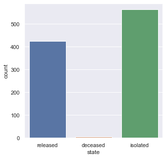

# Exploration des données du COVID-19 (SarS-CoV-2) #

| Nom / Prenom   | Numéro Etudiant |
| -------------- | --------------- |
| Sheikh Rakib   | 11502605        |
| Daudin Louise  | 11606555       |

## Remercients ##

>  Nous tenons principalement à remercier le gouvernement sud-coréen pour la mise à dispositions des données de leur patients en open data qui est disponible (à cette adresse) [à cette addresse](https://github.com/jihoo-kim/Data-Science-for-COVID-19) et [à cette adresse officiel](http://www.cdc.go.kr/)


## Introduction ##

>Ceci est un rapport dans un contexte du devoir universitaire pour l'Institut Galilée pour le module nommé Visualisation de données supervisé par Monsieur GROZAVU Nistor, enseignant rattaché au laboratoire LIPN.
>
>Les données utilisées proviennent de la mise à disposition en open data des données détaillées et anonymisés de la pandémie actuelle nommée Covid-19 (Virus SarS-Cov-2) plus particulièrement connu sous le nom médiatique "Corona Virus".
>
>Une série de graphique sera introduit au fur et à mesure de l'analyse de ces données suite à l'exploration des données par l'outil KNIME.
>
>Etant donnée de l'évolution rapide de l'épidémie, dans le cas où le lecteur tente de reproduire les résultats obtenus, la date de la production des données pour le-dit projet est le 1er Juin 2020.

Au mois de Décembre 2019, une épidémie d'une maladie émergente (Covid-19) due au SARS-CoV-2 a débuté à Wuhan, en Chine, puis s'est rapidement propagée en Chine, et a été déclarée pandémie le 12 mars 2020 par l'OMS. Actuellement, le taux global de mortalité est d'environ 2,3 % en Chine, ce qui est probablement une surestimation car la plupart des patients présentent des symptômes bénins et ne sont donc pas testés. Ce virus s'est propagé dans le monde entier au fil du temps et les Etat-Unis est le pays devenu le cluster principal de la pandémie, suivit de l'Europe. La Chine à recontrée une forte baisse de nouveau cas de la pandémie à partir du 18 Février 2020.

Les symptomes du Covid-19 sont identifiés principalement par les infections des voies respiratoires, les symptômes sont divers et variés. Les patient ont principalement de la fièvre supérieure à 39°C, toux, courbatures, asthénie, céphalées, myalgies, rhinorrhée, dysfonction gustative, perte de l'odorat, obstruction nasale.

Ce devoir pour le cours de Visulalisation de Données se concentrera sur l'évolution de la pandémie au sein de la Corée du Sud avec les données de la KCDC (Korea Centers of Disease Control & Prevention).

## Exploration initiale des données et interpretation graphique ##

Nous allons commencer l'analyse avec un graphe mettant en évidence l'évolution de la pandémie du nombre de cas confirmés cumulés au fil du temps.


Nous remarquons qu'il y a trois stade d'évolution selon le graphique :
*   Début de l'épidémie
*   Propagation rapide de l'épidémie
*   Stagnation de l'épidémie

Nous souhaitons connaitre le taux de cas positifs en fontion de leurs âge (par dizaine d'années) afin de nous donner une idée globale de la tranche d'âge des personnes qui pourraient être considérées les plus vulnérables.

Nous supposons tout d'abord (dans le but de l'analyse) que les personnes les plus vulnérables sont les nourrissons ( tranche d'âge de 0 à 10 ans) et les personnes âgées (50+).


D'après le graphique de données brutes générées, nous remarquons que les personnes ayant une tranche d'âge des 20-30 ans (20s) sont les plus touchées par cette pandémie avec un chiffre total de 824.
De plus, le nombre total des personnes infectées pour les plus de 50 ans est de 1366 avec le calcul suivant

```
600 + 405 + 204 + 156 + 1 = 1366
```

Tandis que pour les moins de 50 ans, ce chiffre s'élève à 1942 par le calcul suivant :

```
56 + 150 + 824 + 452 + 460 = 1942
```

Ces chiffres démontrent que la contamination du virus ne dépend absolument pas de la tranche d'âge liée à l'imunologie de ces personnes.

Il est important de noter que le nombre de nourissons infectés (tranche d'âge 0s) est quand même de 56. Nous nous interessons donc aux dates auxquelles ces personnes ont été déclarée positive au virus.

A titre de référence, d'après les données, la Corée du Sud à déclaré le premier patient positive le 23 janvier 2020.

Le premier cas du nourrison à été déclarée le 24 Février 2020 avec le motif suivant : Contact avec un patient. (Patient : 2000000027)

En remontant la trace de ce patient, le motif principal de cette infection est dû à l'Eglise Shincheonji Church par l'intermédiaire de deux hôtes. (Le premier hote 2000000013 sûrement la mère du nourrisson, classé 30s en age, et le deuxième 1200000031 classé 60s en âge, issu de l'église en question).

*   Nous souhaitons connaître également la répartition géographique par province de l'épidémie des cas confirmées.


*Graphe 1 : Total case confirmed by provinces*

D'après les résultats de cette analyse, nous remarquons que la province de Daegu est la plus touchée avec un nombre total de 6650 cas confirmés. (Données récoltées et générées le 1er juin 2020).

La province de Daegu est composée de 2,463 millions d'habitant (2017) avec une densité de 2812/km² (pour une superficie de 883.5 km²). Ce qui pourrait supposer la propagation du virus favorable à une vitesse considérable (exponentielle).

Nous pouvons supposer que c'est essentiellement aux personnes qui pourraient s'enfuir de la Chine ou bien des expatriés coréens qui sont de retour. Le point de contact principal probable serait l'aéroport International de Daegu de avec les contacts des surfaces et aussi l'échange verbal avec autrui.

Nous disposons néanmoins des données sur la source de la contamination pour les provinces et on peut affirmer que les sources de contamination pour la province de Daego sont les suivantes :

*   L'Eglise de Shincheonji
*   Deuxième Hopital de Mi-Ju
*   L'Hopital Hansarang Convalescent
*   L'Hopital Daesil
*   Fatima Hospital
*   Cheongdo Daenam Hospital
*   Etrangers de passages
*   Contact Patient

Afin de confirmer ou non notre supposition, nous nous intéressons sur la répartition du nombre de cas confirmés entre ces sources de contamination.


*Graphe 2 : Percentage of confirmed case of the Daegu province source origin*

Avec 68 % du nombre de personnes infectées ayant comme source d'infection l'Eglise de Shincheonji, on peut affirmer que c'est l'Eglise qui est la principale source d'infection au sein de la province de Daegu.

Et c'est seulement avec 0.3 % du nombre de personnes infectées par une entrée sur le territoire depuis l'extérieur ce qui contredit absolument la supposition posée concernant l'entrée sur le territoire sur la raison de la propagation, même si cela reste la raison principale de l'importation de celle-ci.

Nous voulons maintenant savoir si la propagation du virus par l'église Shincheonji à joué un rôle principal sur le temps.

On remarque une entrée importante de cas positive sur la période du 18 Février 2020 au 15 Avril 2020. Les valeurs d'entrée ont une flucturation de 18 à 83 personne positif par jour (avec une moyenne de 39 positive par jour sur 57 jours).

En reprenant les données du *Graphe 2* et celle du *Tableau 1*, la région qui recense le moins de cas positif de la pandémie est Jeju-do. Le nombre de cas positive est évaluée à 14.


*Tableau 1: Nombre de cas confirmé par province*

Intéressons-nous sur l'évolution de la pandémie avant que le nombre de cas augmente de manière exponentiel suite au cluster liée à l'Eglise de Shincheonji.

On rappel les deux dates clées suivantes :

*   La date du premier cas recensé sur le teritoire coréen est le 20 Janvier 2020
*   La date du premier cas recensé suite au cluster de l'Eglise de Shincheonji est le 18 Fevrirer 2020.

L'analyse suivante se portera donc sur l'évolution entre 20 Janiver 2020 et le 18 Fevrier 2020.

Durant cette période, il y a 39 cas confirmés liée à la pandémie dont 5 personnes directement liée au cluster du Shincheonji (cf *Tableau 2 en Annexe*).
La date du 18 Fevrier sera donc exclu, et l'analyse se portera donc sur la période du 20 Janvier 2020 au 17 Février 2020.

Comme avec l'analyse sur les données générales brute en début de ce rapport, nous devons connaitre quel est la province la plus touchée durant cette période.


*Graphe 3: Number of case from 20/01/2020 to 17/02/2020 by provinces*

Nous remarquons que 2 province se distingue des autres province à savoir :
*   Seoul avec 14 cas confirmées
*   Gyeonggi-do avec 11 cas confirmées.

Nous remarquons clairement que la province de Daegu ne figure pas sur le *Graphe 3* puisque son nombre de cas est nul. 

*   Comment se fait-il que la province de Seoul soit à 646 patients confirmées étant donnée qu'elle fait partie du cluster sur la période 20/01/2020 - 17/02/2020 ?

Tout d'abord, il faut étudier le motif de la contamination de cette période pour pouvoir comprendre la provenance de la pandémie avec tout les province d'une part, Seoul d'autre part.


Nous remarquons que seul 2 motifs de contamination sont mentionnés :
*   Entrée sur le territoire depuis l'exterieur.
*   Contact par patient.

On s'interesse à la propagation du virus au sein de la province de Seoul.
Durant cette période du 20/01/2020 au 18/02/2020, la province de Seoul comptabilise 14 cas positifs au virus. Elle sont réparties sous formes de deux motifs que l'on a énoncé ci-dessus (à savoir, Flux étrangers et Contact Patient), avec 7 cas respectivement dans ces deux motifs (*Graphe 5*).

En analysant les données donnée par le *Tableau 2*, nous remarquons que les autoritées ont codifiées les identifiants des patients selon la provenance de la province. Ici nous nous interresons à celle de Séoul qui est codifiée par 1 000 xxx xxx.

Nous cherchons à trouver une chaîne de contamination la plus importante au sein de cette province. Nous remarquons donc en triant par ordre croissant du *tableau 2* en ommettant les patient issue de l'Eglise Shincheonji, sur les valeurs de infected_by, le Patient 1 000 000 003 est mentionné 3 fois.

En mettant en lien les sources de contamination au niveau +1 à Séoul.
3 patients ont été contaminés par l'identifiant 1 000 000 003 issue du contact avec le patient lui même identifié par 2 002 000 001 (*Annexe du tableau 3*).

L'identifiant 2 002 000 001 est en fait une erreur d'entrée qui représente finalement l'identifiant 2 000 000 001. Ce patient fait partie du groupe de contamitation de la province du Gyeonggi-do issue d'entrée sur le territoire.

Nous disposons des données d'historique de lieu visités. Ce patient a visité l'Hôpital de Séoul, situé à Gangnam-gu, un magasin dans la même ville et a ensuite fait un déplacement vers la ville de Goyang-si, en Gyeonggi-do dans un restaurant.

Nous pensons que ce patient à contaminé le patient 1 000 000 003 par l'intermédiare des déplacements en transport en commun de type métro (Ligne 3) au sein de la ville de Séoul durant le déplacement de l'hôpital de Gangnam vers la ville de Goyang-si.

Pour arriver à ce résultat, nous avons du placer ces points sur une carte, et les superposer sur une carte de métro. Et nous remarquons qu'en effet, la ligne 3 passe près de deux points de contact, l'hôpital de gangnam et le restaurant situé à Jongno-ju. Les points qui sont données dans la base de données sont des coordonnées GPS latitude/longitude.

Nous pouvons dorénavant affirmer que la transmission s'est fait en déplacement par utilisation des transport en communs.

Cependant nous ne savons pas si le patient 2 000 000 001 est passé par l'Aéroport ou bien par un port naval. En effet, le motif de ce patient à été déclaré en tant que flux étranger (Entrée sur le territoire). On peut seulement supposer que c'est le cas.

En reprenant les données de la répartition des cas d'infection du *Graph 4* et en les mettant en lien avec la trace des lieu visités (*Tableau 4 en annexe*). Les 16 patients ont été contaminé par l'intermédiaire des services hospitaliers qui ont acceuilli les patients du flux étrangers.

*   Quel est l'évolution de la pandémie pour la province de Gyeonggi-do durant cette période ?

La province de Gyeonggi compte 11 patients positifs au virus pour la période du 20/01/2020 au 17/02/2020. Elle se répartie sur deux motifs de contamination qui sont les mêmes que ceux cité pour Séoul (à savoir Flux étrangers, Contact avec Patient).


On remarque qu'il y a plus de patient contaminé par contact patient que par les flux étrangers.

En appliquant le même procédé de l'analyse effectuée sur Séoul, nous remarquons qu'il y a une chaine de contamination issue directement du flux étranger chinois.

Il s'agit du patient 2 000 000 010 en provenance de la Chine qui à contaminé deux autre patient par contact patient. (*Tableau 5*).


*Tableau 6 : Mise en évidence du lieu de contamination formée par la chaine 20-8 20-9 et 20-10*

Le lieu de la contamination est encore une fois le service hospitalier en faisant la trace des lieu visitées.

Ces analyse permettent de déduire que la cause de la formation d'une chaine de contamination est dû au patient qui se retrouve au service hospitalier au contact direct avec d'autres patients. On peut suppposer que la visite au service hospitalier est soit pour une consulation bénigne, soit pour une présentation au service des Urgences.

*   Comment l'Eglise Shicheonji est devenue en une journée, un cluster ayant entrainé la propagation rapide au sein du pays ?

Nous savons que le 18/02/2020, 5 patients issus de l'Eglise Shincheonji sont positifs au virus. L'analyse se portera particulèrement sur ces 5 personnes.

Nous rappelons les données qui sont à disposition pour l'analyse concernant ces patient dans le Tableau 7 suivant :


*Tableau 7 : Liste des patient qui sont positive à la date de 18/02/2020 issue de l'Eglise Shincheonji.*

Nous remarquons que nous avons pas d'informations si ces 5 patients ont été contaminés par des patients déjà connu antérieur à cette date. En revanche, le patient 6 015 000 002 attire notre attention car il n'est pas en provenance de la province de Daegu mais de Gyeongsangbuk-do.

En voulant retracer l'historique des lieux visitée, nous possedons aucune information concernant celle-ci.

En regardant les numéro des patient depuis le début de l'épidémie, la patient 31 (12 000 000 031) est le premier à être testé positif faisant partie à l'Eglise.

Son historique des lieux visité (*Tableau 8*) ne correspond à aucune information qui peut être utilisée pour remonter son lieu de contamination.

Nous sommes donc toujours dans le flou sur l'origine de la contamination massive à partir de l'église. Nous savons seulement que c'est à partir de la patiente 31 que la propagation s'est accelerée. Ceci c'est une situation très similaire dans le cas de la France impliquant l'Eglise de la Porte Ouverte dans le cadre d'un rassemblement religieux.

Reprenons l'analyse de la propagation à partir du moment où l'Eglise est devenu le cluster principal le 18/02/2020.


Le pic des patients positifs à été atteint le 5 mars 2020, étudions l'évolution rapide entre la période du 18/02/2020 au 5/03/2020.

Nous remarquons qu'il y a une augmentation de 1463 de cas positifs sur cette période, ce qui porte au nombre total de 1493 de cas positifs depuis le premier cas recensé.


L'augmentation considérable du nombre de cas positifs est dû aux deux raisons suivantes :
*   "Contact avec un patient"
*   "etc."


Les provinces qui ont fortement contribuée à ces résultats sont :
*   Gyeongsangbuk-do (203)
*   Gyeonggi-do (99)


*Tableau 9 et 10: motifs de contamination en début de propagation*

En étudiant les données de Gyeongsangbuk-do avec tout les motifs recensés, nous remarquons que l'origine de la propagation du virus est issue de l'Eglise Shincheonji Church. Il en est de même pour Gyeonggi-do. Les contacts patients ont pris le relais pour accelerer la contanimation locale. Ce qui laisse suppposer que l'Eglise à dû organiser un événement dans le but de rassembler les personnes venant d'autres villes. La contaminiation s'est donc développée rapidement sur les autres provinces.


*Graph des motifs de contamination au fil du temps*

Analysons les motifs de contamination au jusqu'au 15/05/2020. Nous partons du principe qu'à partir de 20 personnes contaminées pour le même motif et le même est considéré comme foyer de contamination.

Nous pouvons donc recenser les foyers de contamination suivants :
*   Bonghwa Pureun Nursing Home
*   contact with patient
*   Guro-gu Call Center
*   Dogan Church
*   Iaewon Clubs

A partir de ce graphe, nous pouvons affirmer que la propagation du virus se fait principalement au sein de l'Eglise, les tranports en commun (d'ou la propagation vers les autres villes) et au sein des services hospitiliers.

Affinons l'analyse avec la manipulation des données par python.

Nous souhaitons connaitre le nombre de cluster analytique des données.


Nous remarquons qu'après le score de 3 cluster, la courbe va tendre vers 0.

Nous transposons les données de clusters sous forme d'un graphe qui suit :


Nous remarquons bien qu'il y ai 3 cluster qui sont distingués par les 3 couleurs.

En les transposant une nouvelle fois ces données vers une carte, nous avons donc une représentation visuelle de la localisation des cas confirmées.


*Carte 1 : Localisation des cas confirmés*

Nous allons afficher le nombre total de motif de contamination afin de confirmer les 3 clusters principaux qu'ont été cité (Guro-gu Call Center, Shincheonji Church, Itaewon Clubs).


Nous remarquons que "contact with patient" occupe la première place, ce qui est logique car la pandémie progresse par contact patient du service hospitalier.

De plus, 600 personnes issues des flux étrangers ont été recensées ce qui est également logique avec le retour massive depuis la ville de Wuhan avant son confinement (et aussi venant d'autres pays).

Le motif "etc" regroupe tous les cas en cours d'investigation par les autoritées sanitaires, celui ci peut principalement correspondre aux transports en commun.

On retrouve finalement nos trois clusters principaux avec ce graphe, ce qui confirme bien qu'il sont des cluster principaux.


Ce graphe recense les lieus les plus visités avant la déclaration d'un patient confirmé. On remarque que ce sont : 
*   Les hôpitaux (29.6 %)
*   Les magasins (28.9 %)
*   Les restaurants (9.44%)
*   Les tranports en commun (7.56 %)

qui reviennt très fréquement.


On a ici une répartition de tous les patients regroupés par la cause de l'infection en fonction de leur groupe d'age. On peut remarquer que les lieux de travail tel que les hopitaux touchent principalement les adultes. Tandis que les églises touche les adultes et les enfants.

---

Le virus a tué de 71 personnes parmis les  personnes infectées, ce qui donne un taux de mortalité de 0.01%. Cependant, les chiffres ne sont pas exact lorsque l'on compare au données gouvernementales. Nous suspectons qu'il y ait un problème de mise à jour de leur part, ce qui explique la différence entre les données disponibles et les données communiniquées par la presse. Le chiffre de mortalité attendu est de 262 pour 11037 cas confirmées (0.02%).


*Chart 10: Number of death grouped by age*

| 0 | 10 | 20 |  30  |  40  |  50  |  60  |  70  |  80   |  90   | 100 | Total |
|---|----|----|------|------|------|------|------|-------|-------|-----|-------|
| 0 | 0  | 0  | 0.22 | 0.43 | 1.18 | 3.05 |  10  | 17.29 | 18.42 |  0  | 50.59 |

*Tableau 11: Taux de mortalité en fonction de l'âge exprimé en pourcentage*

Nous pouvons remarquer qu'au niveau de la mortalité, les personnes agés de plus de 50 ans sont les plus touchées par cette pandémie avec 23 patients agés dans la tranche de 80 ans, 19 pour la tranche de 70 ans et 7 pour la tranche de 90. Ce qui représente 17.29 % (10 % et 18.42 % respectivement) de taux de mortalité pour cet âge avec un total de 50.59 %.

Nous allons démontrer que le taux de mortalité est quand même relativement faible.




Puisque les données que nous possèdont ne sont pas à jour, nous avons 71 morts, ce qui représente un taux de 2.02 %. Notons néanmoins que 58.1 %  des patients qui étaient infecté ne le sont plus (ou bien déchargé des services hospitaliers) et que 39.9 % sont en confinement.

*   Simulation de l'évolution de la pandémie.


Nous avons utilisé un modèle de régression des données avec un réseau neuronal implémentaire depuis la librairie MLPRegressor (par le biais Sklearn) Nous remarquons qu'une droite de type `Ax+B` est tracée, ce qui indique la prédiction de l'évolution de la pandémie. Cependant, La prédiction est faussé à partir du mois d'Avril puisque la courbe actuelle des cas confirmées converge en un point l.

La simulation des données par la bibliothèque prophet est une correction analytique les prédictions effectuée par MLPRegressor ce qui rend réaliste les prévisions à court terme.


La courbe bleu représente les données simulées par prophet et les points noirs représentent les donnnées actuelles. La zone bleue est l'intervalle de confiance probable du nombre de cas confirmés dans le court terme. On remarque que cette intervalle augmente au fil du temps.


Ce graphe est la prédiction sur 1 semaine journalière de la tendance de l'épidémie à partir du 15 mai 2020. Elle annonce un pic estimé à la journée de Mercredi avec une baisse du nombre de cas.

Un patient qui a été confirmé au virus peut, au fil du temps, soit :
*   Guérir
*   Décéder

Le graphe suivant permet de démontrer le nombre de journées qu'il faut pour qu'un patient rentre dans l'une des deux catégories citées ci-dessus


Nous remarquons qu'un patient met plus temps à guérir qu'à mourir. La différence entre les deux est l'ordre de 2 jours.


Ce graphe met en évidence sur la mortalité des personnes agées, en effet, à partir de 50 ans, ces personnes sont plus succetible de mourrir à cause du virus, ce qui démontre le taux de mortalité parmis les mort à 50.59%.

Le gouvernement a décider de tester sa population, le graphe suivant permet de mettre en évidence le ratio des tests positifs (en orange) et négatifs (en bleu). Le nombre de tests est porté à environ 700 000.


Sous forme de courbe


*  Reaction des autorités (Policy.csv)

Les autorités ont très rapidement pris conscience de la gravité de la pandémie. De ce fait, l'Alerte rouge à été lancée une semaine suivant la contamination massive du cluster de l'Eglise Shincheonji. Ils ont instauré une procedure spéciale d'immigration en fonction de la gravité des cas des autres pays.

Dès le premier cas recensé au sein du pays et afin de gagner la confiance de ses citoyens, les autorités ont mis a disposition en accès libre les données de la pandémie annonymisées afin d'aider le gouvernement à comprendre l'évolution de la pandémie.

Ce n'est qu'au 13 Avril 2020 que les autorités ont déployé les kit de diagnostics d'urgence pour le test massif de la population.

A partir du 26 Fevrier 2020, des contrôles routiers sont effectués par le biais de la prise de température dans le but de contenir au maximum la contamination.

Le 27 Février 2020 marque le début de la distribution massive des masques pour ses citoyens avec une rotation de 5 jours.

La campagne de distantation sociale a débuté le 22 mars 2020 très massivement afin de lutter contre la croissance rapide déjà en place par les évements de l'Eglise Shincheonji.

Les autorités ont aussi élaboré des bracelets électroniques pour les citoyens qui seraient positif au virus dans le but de faire respecter le confinement.

L'ordre de fermer les bars et les boites ont été ordonnées le 8 mai 2020 et ce, pour une durée d'un mois.

Ces décisions successives ont permis "d'applatir" la courbe des cas confirmées cummulée dans le but de soulager les services hospitaliers qui serait en surcapacité.


## Conclusion de l'Analyse ##

La Corée du Sud est touché par cette pandémie quelques semaines après la Chine le 20 Janvier 2020 par l'intermediaire l'entrée sur le territoire Coréen en provenance de Chine. La propagation du virus était au ralenti puisque les contamination se fesait au niveau des services hospitaliers. La pandémie s'est accélérée au sein du pays de manière exponentielle suite à l'infection par l'Eglise de Shincheonji. La province de Daegu par la suite est devenu le cluster principal de la pandémie au sein du pays, et le reste toujours aujourd'hui. Cependant, la Corée du Sud a réussie à contrôler la propagation du virus malgré le récent cluster de Iaewon Club et Dogan Church.

La pandémie touche toutes les tranches d'âges, plus particulièrement la tranche d'âge de 20 ans. Elle est en revanche mortelle à partir de 50 ans, avec une mortalité cummulée de 96 % (50.59 % pour le taux de mortalité cummulée).

La récente évolution de la pandémie laisse penser que la Corée du Sud est au stade de la décrue. En effet, la forte vague de cas positifs s'est déroulée du 18 Févriér au 15 avril pour une durée totale de 57 jours.

---

# Annexes #


*Flow Chart  du graphe 1*


*Flow Chart  du graphe 2*


*Tableau 2 : Liste des patients contaminés avec les mentions Shincheonji du 18 Fevrier 2020.*


*Tableau 3 : Liste des patients dont le nombre contamination par le même contact patient est le plus élevée*


*Tableau 4 : Mise en valeur de 'L'Hôpital' comme lieu de passage principal favorisant la contamination du virus.*


*Tableau 5 : Mise en évidence d'une chaîne de contamination au sein de la province de Gyeonggi-do avec un flux étranger chinois*.


*Flow Chart 3 : workflow pour les données de Seoul et Gyenggi-do respectivement*


*Tableau 8 : Historique des lieux visité de la part du patient 31 (12000000031)*


*Workflow : KNIME*
